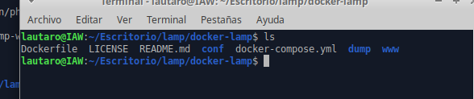
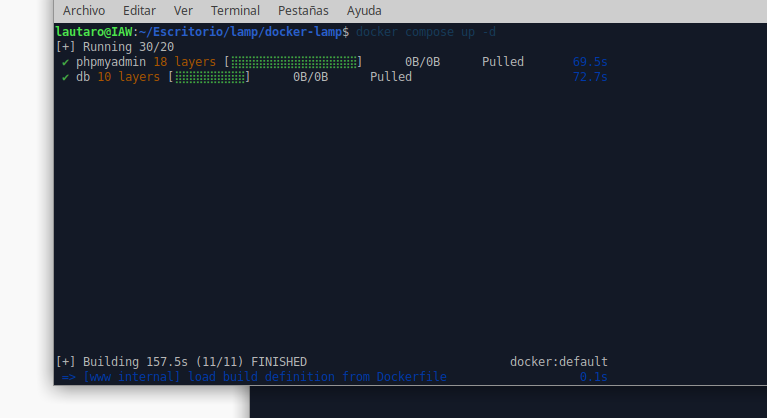
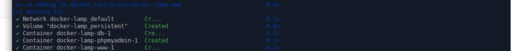
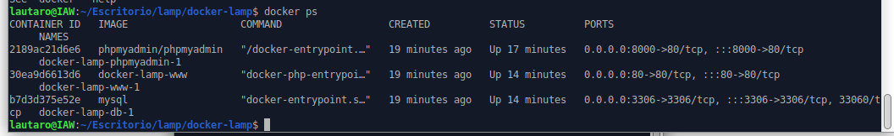
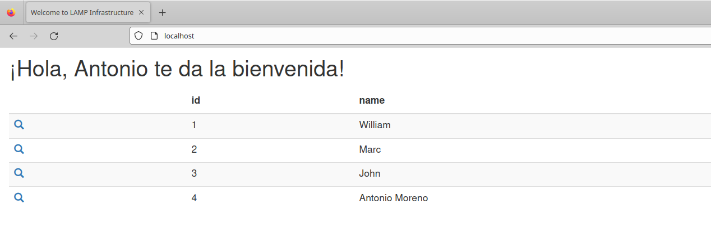
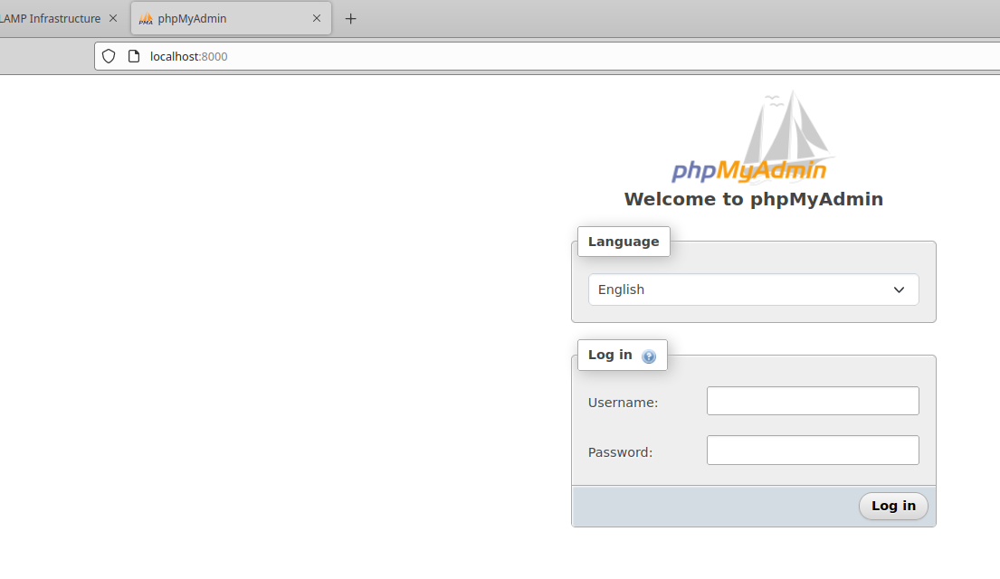
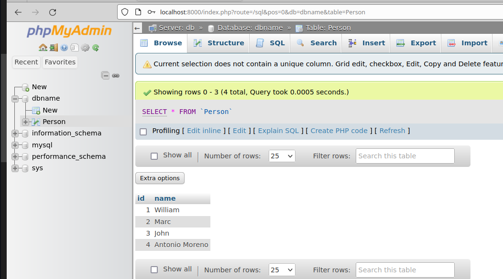

# 
 *Pila de LAMP con docker compose* 

+  Primero clonamos desde github la carpeta con todos los archivos necesarios para el docker compose:

          git clone https://github.com/jersonmartinez/docker-lamp.git
Y vemos que se clono perfectamente:

En esta carpeta tenemos el dockerfile y el docker-compose que son los archivos decesarios para construir la imagen y crear los contenedores.

+ Ya con la carpeta clonada lo que necesitamos es ejecutar el siguiente comando para crear todos los contenedores necesarios en base al docker compose.

        
        docker compose up -d

Vemos que se ejecuta y empieza a generar descargas:

Y cuando termina de descargar e instalar nos muestra que esta todo correcto, nos dice que a creado la red, el vlumen, la abse de datos, phpmyadmin y por ultimo la web:

+ Luego hacemos un docker ps  para comprovar que los contenedores esten en marcha: 

        docker ps

En esa imagen vemos los 3 contenedores corriendo (la web,mysql y phpmyadmin) y vemos los puertos, como la web esta en el puerto 80 comprovamos que todo funciona ingresando a la web:

Tambien vimos que phpmyadmin esta en el puerto 8000 por lo que ingresamos a localhost:8000 y ahi lo tenemos:

Entramos a la base de datos y vemos los datos que vimos antes en el apache:

Comprovando que podemos ingresar a phpmyadmin ya comprovamos que mysql esta corriendo bien ya que van de la mano

