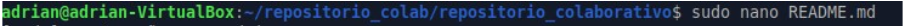

# *<u> Segunda parte de la tarea </u>*

## *Trabajo por parejas*

### **1. Crear un repositorio :**
---

Adrian creo el repositorio colaborativo justo con ese nombre (repositorio colaborativo) y me invito x enlace de github :
**[GitHub](https://github.com/Lauty04)** 

Como vemos desde el github de lautaro tmb ya esta el repositorio (Milian732/repositorio_colaborativo): 

Luego lo que hicimos fue clonar el repositorio en linea al local nuestro: 

### **2.  Trabajar por parejas sobre este repositorio creando ramas y haciendo commits sobre el mismo fichero generando quque aparezca un conflicto :**

Ahora empiza lautaro creando archivos y subiendolos al remoto (aclaramos que el ususario principal2do es sobre la maquina de lautaro), creamos el archivo adrian.txt.

Lo siguiente fue crear un fichero README en remoto para probar un pull a la local de lautaro(principal2do) y vemos que se realiza bien y tenmos el README:
    *En la captura ya sale con un contenido editado porque durante el proceso lo editamos*

Durante el proceso Adrian creo el archivo lautaro txt lo subio a la remota y despues hizo pull para que quede su local igualada a la remota tanto como lo hizo lautaro, vemos que la maquina de adrian y lautaro estan actualizdaas al repositorio: 

La proxima captura se refiere a lo mismo pero justo sale la creacion y subida de otro archivo, vemos el pull de lautaro y la subida de otro archivo que antes veiamos que adrian ya lo tenía porque la captura es de despues de el push y hizo el pull: 

Ahora creamos nuestras ramas particulares en local y las subimos a remoto tmb. 

 

   
Ahora lo que hicimos fue merchear el main a nuestras ramas, tanto lautaro como adrian. 

### **3. Gestión y resolución del conflicto :**
---
Para generar el conflicto decidimos editar el fichero README cada uno en su rama, procedimos a subirlo a remoto y luego la mergeamos con el main: 

Todo lo que yo hice de entrar a mi rama modificar el fichero subirlo a remoto adrian hizo lo mismo pero en su rama y lo mergeo al main en local, ahora llegamos al conflicto cuando Adrian quiere hacer un push de su main local a remoto ya que en remoto esta lo que yo habia pusheado de mi main con el README editado. 

Ahí vemos el error cuando adrian quiso hacer el pull que los dos README entran en conflicto y debemos arreglarlo. 

En la proxima captura vemos el git status con el error bien claro que tenemos:

    

Para arreglarlo Adrian procede a igualar el fichero READMe al mio: 

Ahora con el fichero arreglado hace un push y luego un pull para descargar si hay cambios o algun error y vemos que esta todo bien: 

Lautaro hace un pull para ver que no de error y vemos que los ficheros tienen el mismo contenido, todo esto hablamos trabajando sobre las ramas main locales de cada uno: 

### **4. Mostrar cómo aparece el historial de commits con las fechas y los autores, tanto desde consola como desde github :**
---

### Probamos un trozo de código:

~~~bash
#!/bin/bash

Este es un script simple en Bash
echo "Debería aparecer el eco?"
~~~

### Alumnado: 
    
[Para ver la tabla hazclik aquí](/RamasMD/tabla.md) !