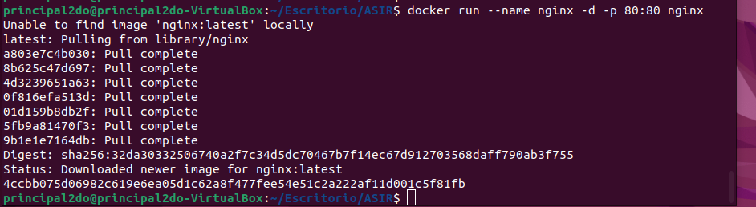

# 
<u>*Tarea 4:Primeros pasos con Docker*</u>

## <u>*1. Instala docker en una máquina y configúralo para que se pueda usar con un usuario sin privilegios.*</u>

Lo que hice para que mi usuario pueda ejecutar docker sin privilegios fue meterlo al grupo de docker y ya podia ejecutar sin ser sudo.

## <u>*2.Ejecuta un contenedor a partir de la imagen hello-word. Comprueba que nos devuelve la salida adecuada. Comprueba que no se está ejecutando. Lista los contenedores que están parado. Borra el contenedor.*</u>

Vemos que cree la imagen hello-world y nos devuelve 'Hello from Docker'

Vemos que no hay ningun contenedor corriendo y en el -a para ver todos y ahí vemos el contenedor con la imagen hello-world que creamos.Luego lo borramos y otra vez con el ps -a vemos que ya no existe.

--- 

## *3.Crea un contenedor interactivo desde una imagen debian. Instala un paquete (por ejemplo nano). Sal de la terminal, ¿sigue el contenedor corriendo? ¿Por qué?. Vuelve a iniciar el contenedor y accede de nuevo a él de forma interactiva. ¿Sigue instalado el nano?. Sal del contenedor, y bórralo. Crea un nuevo contenedor interactivo desde la misma imagen. ¿Tiene el nano instalado?*

Vemos que con el comando run -it creamos el contenedor de la imagen debian en interactivo y al lado vemos con un ps que esta corriendo.

Instalamos el paquete nano.

Cerramos el contenedor y vemos que ya no esta corriendo ya que lo predeterminadamente funcionan así y no persista,luego lo podemos modificar arrancandolo con el exec.

Iniciamos nuevamente el contenedor de forma interactiva con -i. Y vemos que el nano sigue instalado.

Borramos el contenedor.

Creamos nuevamente el contenedor y vemos que no tiene instalafo el nano logicamente.

---
---

### *4.Creamos un contenedor con la imagen de nginx y le indicamos el puerto que va a tener abierto.*
    
    docker run --name nginx -d -p 80:80 nginx

Vemos que esta encendido.

Y podemos comprobar que funciona entrando al localhost.

Mostramos los logs del contenedor.

    docker logs nombre-contenedor
    docker logs nginx

---
---

### *Crea un contenedor con la aplicación Nextcloud, mirando la documentación en docker Hub, para personalizar el nombre de la base de datos sqlite que va a utilizar.*

Lo que hicimos fue descargar la imagen de nextcloud y una vez que la tenemos hacemos el docker run con la opcion -d para ejecutarse en 2do plano, le damos el nombre le abrimos el puerto con el -p y empezamos con la configuración de nexcloud dandole -e y dandole un usuario contraseña y con el -e de sqlite le damos el nombre

    sudo docker run -d --name=nextcloud-p 8080:80 -e NEXTCLOUD_ADMIN_USER=lautaro -e NEXTCLOUD_ADMIN_USER=lautaro -e SQLITE_DATABASE=lautarodb.sqlite nextcloud 

Vemos que el contenedor esta arrancado y ya pudimos con el localhost entrar y logearnos en nextcloud.

Como vemos en la ruta /var/www/html/data tenemos el fichero de configuracion de la base de datos con el nombre lautaro.db que le habiamos dado antes.

